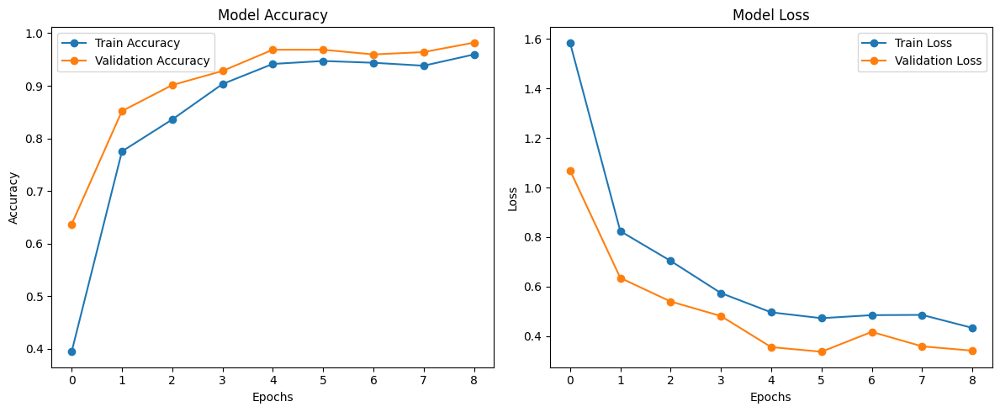
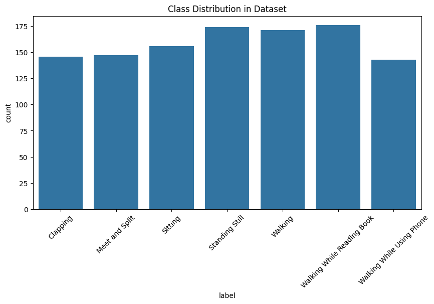
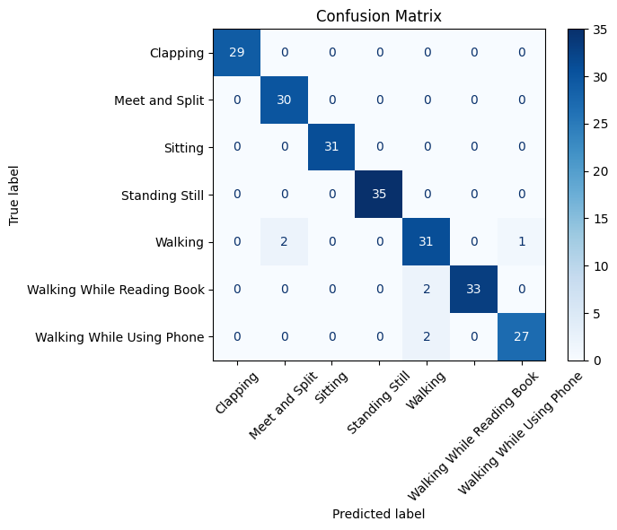
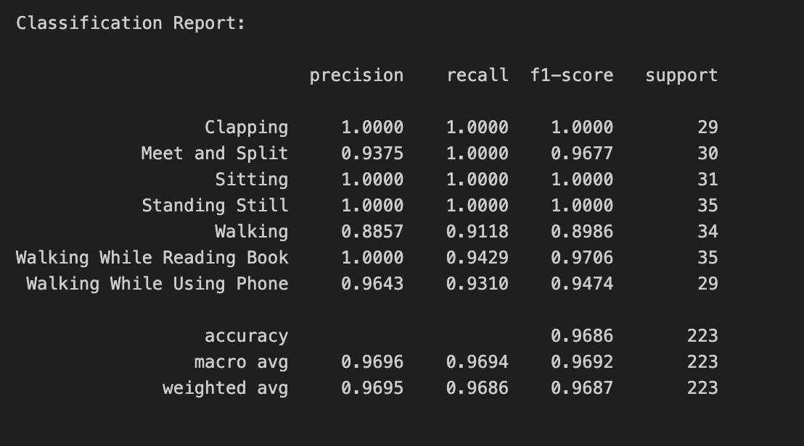
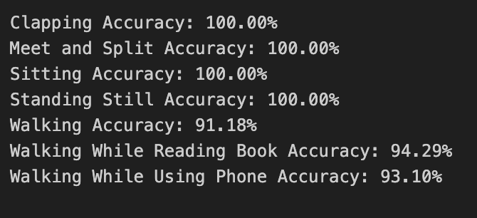

# Human Activity Recognition using Deep Learning and Video Classification

A deep learning-based Human Activity Recognition (HAR) system that classifies human activities from video data using Convolutional Neural Networks (CNN).

---

## 📌 Project Overview

This project focuses on recognizing and classifying human activities from video frames using Deep Learning techniques. The model was trained on a video-based HAR dataset and can classify activities such as:

- Clapping
- Meet and Split
- Sitting
- Standing Still
- Walking
- Walking While Reading Book
- Walking While Using Phone

The project includes:

- Data preprocessing
- Video frame extraction
- CNN model training
- Performance evaluation
- Visualization of results

---

## 🧠 Model Performance

### ✅ Final Accuracy
- **Overall Accuracy:** `96.86%`

### 📊 Classification Metrics

| Activity | Accuracy |
|---|---|
| Clapping | 100.00% |
| Meet and Split | 100.00% |
| Sitting | 100.00% |
| Standing Still | 100.00% |
| Walking | 91.18% |
| Walking While Reading Book | 94.29% |
| Walking While Using Phone | 93.10% |

---

## 📂 Dataset

Dataset used for this project:

[Human Activity Recognition Video Dataset (Kaggle)](https://www.kaggle.com/datasets/sharjeelmazhar/human-activity-recognition-video-dataset/data)

---

## 🛠️ Technologies Used

- Python
- TensorFlow / Keras
- OpenCV
- NumPy
- Pandas
- Matplotlib
- Scikit-learn
- Jupyter Notebook

---

## 📁 Project Structure

```bash
Human-Activity-Recognition/
│
│
├── activity_model.h5
│
├── images/
│   ├── accuracy_loss.png
│   ├── class_distribution.png
│   ├── classification_report.png
│   ├── classwise_accuracies.png
│   └── confusion_matrix.png
│
├── HAR_Video_Classification.ipynb
│
├── requirements.txt
├── README.md
└── .gitignore
```

---

## 🚀 Installation

Clone the repository:

```bash
git clone https://github.com/your-username/Human-Activity-Recognition.git
cd Human-Activity-Recognition
```

Install dependencies:

```bash
pip install -r requirements.txt
```

---

## ▶️ Run the Project

Open Jupyter Notebook:

```bash
jupyter notebook
```

Run:

```bash
HAR_Video_Classification.ipynb
```

---

## 📈 Training Results

### Model Accuracy & Loss



### Dataset Class Distribution



### Confusion Matrix



### Classification Report



### Class-wise Accuracy



---

## 🧪 Model Architecture

The project uses a CNN-based architecture for extracting spatial features from video frames and classifying activities.

### Workflow

1. Video Collection
2. Frame Extraction
3. Image Preprocessing
4. CNN Feature Learning
5. Activity Classification
6. Evaluation & Visualization

---

## 📌 Key Features

- Deep learning-based activity recognition
- Video frame preprocessing pipeline
- Multi-class activity classification
- Confusion matrix visualization
- Class-wise accuracy analysis
- High validation accuracy with low loss

---

## 📉 Observations

- Static activities such as **Sitting** and **Standing Still** achieved near-perfect accuracy.
- Dynamic activities involving movement showed slight confusion due to motion similarities.
- The model generalizes well with minimal overfitting.

---

## 🔮 Future Improvements

- Use LSTM/CNN-LSTM for temporal learning
- Real-time webcam activity detection
- Transformer-based video classification
- Deploy using Flask/Streamlit
- Mobile optimization using TensorFlow Lite

---

## 👨‍💻 Author

**Yagnesh Galla**

If you found this project useful, consider giving it a ⭐ on GitHub.

---

## 📜 License

This project is for educational and research purposes only.
